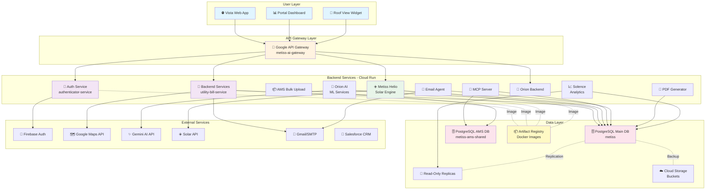
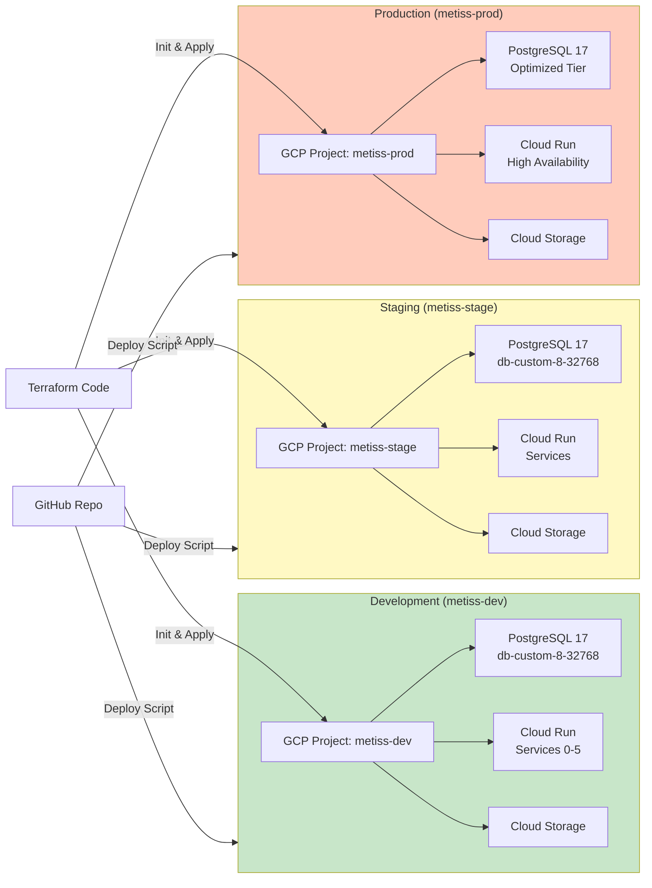
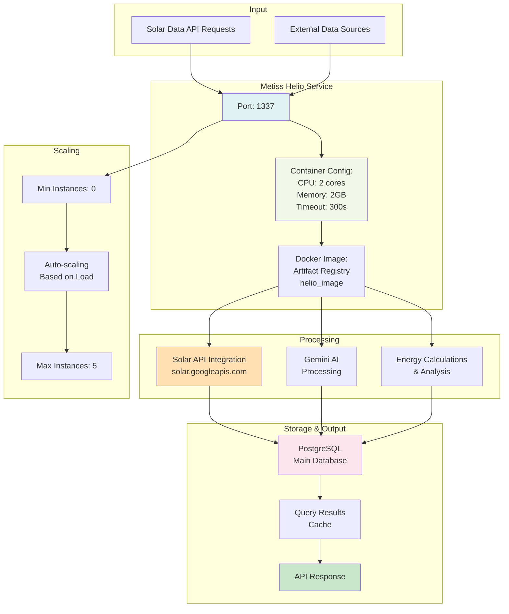
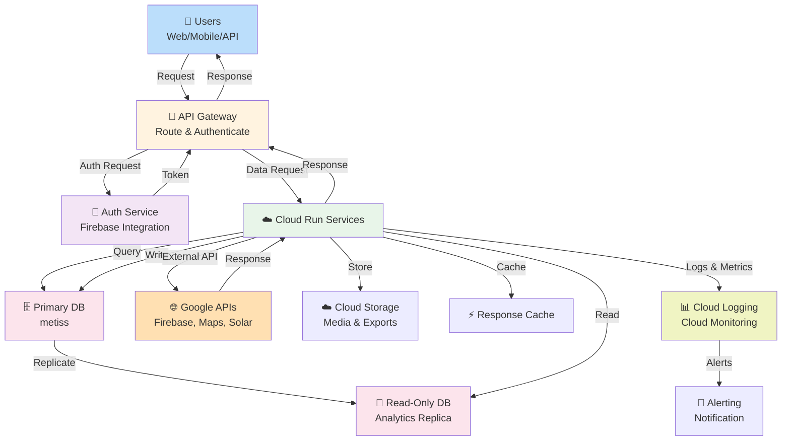
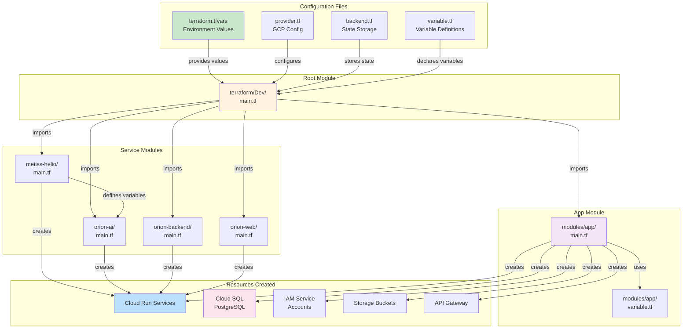
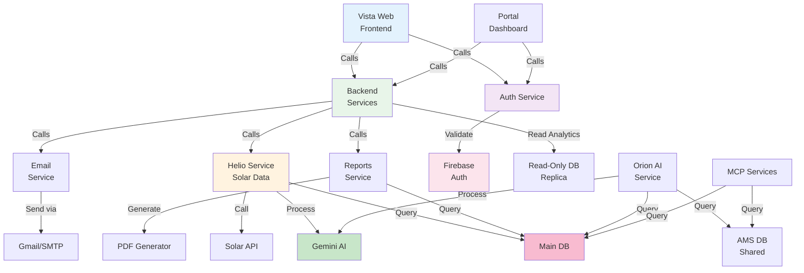

# MEtiss Architecture Diagrams

## 1. System Architecture Diagram

## 2. Deployment Environment Architecture

## 3. Metiss Helio Service Architecture

## 4. Data Flow Diagram

## 5. Terraform Infrastructure Code Structure

## 6. Deployment Pipeline

```mermaid
graph LR
    CODE["👨‍💻 Code Commit<br/>to GitHub"]
    
    CODE -->|Push| REPO["📦 GitHub<br/>Repository"]
    
    REPO -->|Trigger| BUILD["🔨 Build Docker<br/>Image"]
    
    BUILD -->|docker build| IMG["🐳 Docker<br/>Image"]
    
    IMG -->|docker push| ARTIFACT["📦 Artifact<br/>Registry"]
    
    ARTIFACT -->|Image Reference| PLAN["📋 Terraform Plan<br/>terraform plan"]
    
    PLAN -->|Review Changes| APPROVAL["✅ Approval<br/>Gate"]
    
    APPROVAL -->|Approved| APPLY["🚀 Terraform Apply<br/>terraform apply"]
    
    APPLY -->|Creates/Updates| RUN["☁️ Cloud Run<br/>Service"]
    
    APPLY -->|Configures| DB["🗄️ Database<br/>Settings"]
    
    RUN -->|Pulls Image| ARTIFACT
    
    RUN -->|Running| PROD["✨ Production<br/>Service"]
    
    PROD -->|Monitored| LOGS["📊 Cloud Logs<br/>& Metrics"]
    
    LOGS -->|Alerts| TEAM["👥 DevOps<br/>Team"]

    style CODE fill:#c8e6c9
    style REPO fill:#bbdefb
    style BUILD fill:#fff9c4
    style IMG fill:#ffccbc
    style ARTIFACT fill:#f8bbd0
    style PLAN fill:#e1bee7
    style APPLY fill:#c5cae9
    style RUN fill:#b2dfdb
    style PROD fill:#a5d6a7
    style LOGS fill:#fff9c4
```

## 7. Service Dependencies Graph

---

**Diagrams Generated**: 7 comprehensive architecture diagrams
**Format**: Mermaid (auto-rendered in most markdown viewers)
